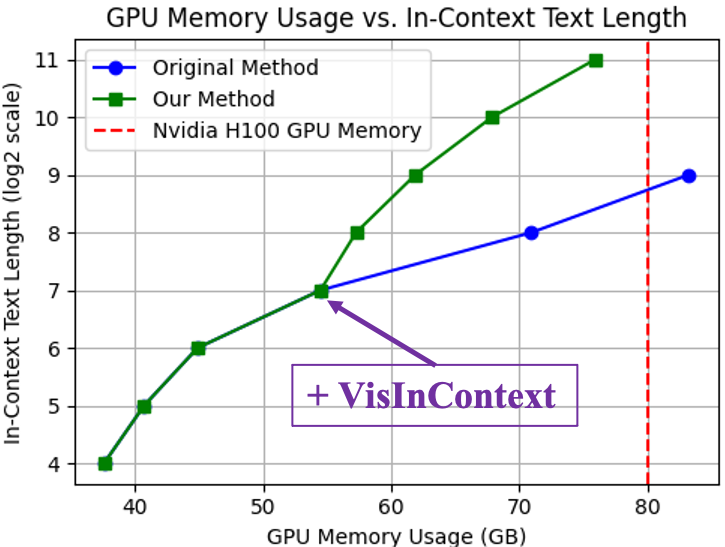

# VisInContext



- VisInContext is a easy way to increase the in-context text length in Multi-modality Learning.
- This work is also complement with existing works to increase in-context text length like FlashAttn, Memory Transformer.


## Install

```
pip install -r requirement.txt
```

For H100 GPUS, run the following dependencies:

```
pip install -r requirements_h100.txt
```


## Dataset Preparation
See [DATASET.md](DATASET.md).


## Pre-training
See [PRETRAIN.md](PRETRAIN.md).

## Few-shot Evaluation
See [Evaluation.md](EVALUATION.md)


## Citation

If you find our work helps, please consider cite the following work

```
@article{wang2024visincontext,
        title={Leveraging Visual Tokens for Extended Text Contexts in Multi-Modal Learning},
        author={Wang, Alex Jinpeng and Li, Linjie and Lin, Yiqi and Li, Min  and Wang, Lijuan and Shou, Mike Zheng},
        journal={arXiv preprint arXiv:2406.02547},
        year={2024}
    }

```


## Contact
Email: awinyimgprocess at gmail dot com


## Acknowledgement
Thanks for these good works.
 [Open-flamingo](https://github.com/mlfoundations/open_flamingo), [Open-CLIP](https://github.com/mlfoundations/open_clip) and [WebDataset](https://github.com/webdataset/webdataset).